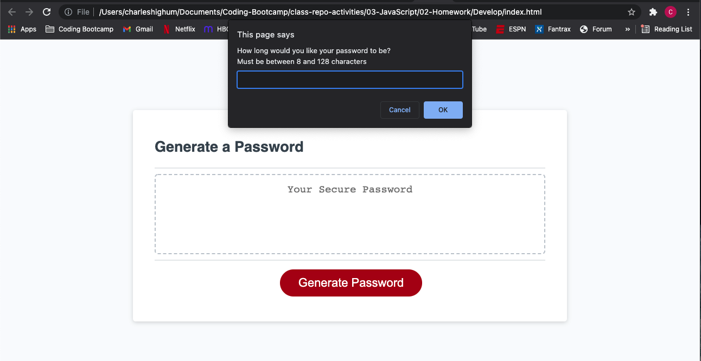
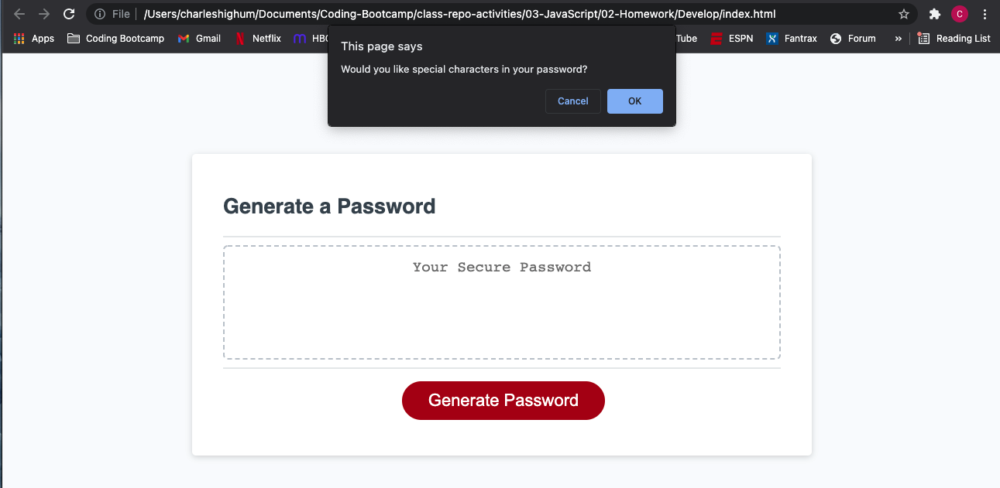
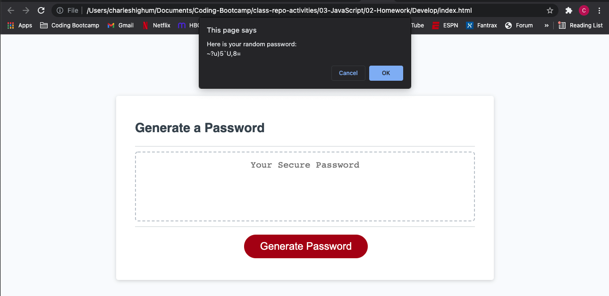

# Homework 3 - Password Generator

## Description

For Homework 3 of the DU coding bootcamp I was tasked with creating a random password generator that runs through a series of prompt and confirm messages written in Javascript. The user decides the length between 1 and 128 characters and selects up to four different types of characters, lower case, upper case, numbers, and/or special characters. This is very helpful in todays world as a randomly generated password containing at least one of each option is nearly impossible to hack and therefore would allow you to scroll the web with your mind at ease.

In order to create this password generator, I made a master object with four arrays of all the character types available declared globally. Next, the user is presented with a prompt to select length, and four confirms to select different character types. By analyzing the users inputs on character selection, it eliminates the options that they don't want and then creates one array of all the possible options they do want. From there it simply iterates across that array selecting random values and storing them in a string until it reaches the users' desired length. Lastly, the new password is presented to the user in an alert window.

Maybe the way I went about this assignment wasn't necessarily the easiest and required some extra steps for error control, but it certainly helped me to learn a lot about a variety of Javascript elements. The base of the assignment required using prompts, confirms, and alerts through Javascript which was great practice, especially adding in the error handling using if statements. I also used an object with booleans from the user input, functions embedded in functions, and a for loop iteration to randomly select the password in the end. Where things got a little confusing for me and required some W3Schools and MDN Web Docs assistance was with performing methods on my master object full of arrays. First, I needed to clone it inside the function so the master object wouldn't be changed which required a Object.assign({}, obj). Second, I had to do a more complex
[].concat.apply([], Object.values())
in order to convert the user chosen characters into one large array to be iterated on.

## Usage

If you would like to be able to generate your own random passwords, you can access the website at the following link: https://chighum.github.io/Homework3-Password_Generator/

You can also see a few screenshots of what the deployed website looks like in action below:

The first prompt asking for number of characters:

One of the four character cofirmations:

Random output from 10 character length including all types:

## Credits

I collaborated on this assignment with my brother, Thomas Highum, who's Github repository for his own unique take on the same password generator assignment can be found at: https://github.com/thomashighum/password-generator
